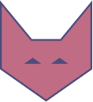

<p align="center">
  <a href="https://github.com/sevenns/leesa.js" title="leesa.js"></a>
  <h3 align="center">leesa.js</h3>
</p>

<p align="center">Small framework for standard frontend development</p>

## Requirements

- [nodejs](https://nodejs.org/en/) (LTS or higher)
- npm or [yarn](https://yarnpkg.com/)

## Installation

- **Add leesa to your project**

``` bash
yarn add leesa --dev
```

- **Setup scripts in package.json**

``` json
{
  "scripts": {
    "dev": "leesa",
    "build": "leesa build",
    "start": "leesa start",
    "icons": "leesa icons"
  }
}
```

## Usage

``` bash
# Serve with hot reload
yarn dev

# Build for production
yarn build

# Launch in production mode
yarn start

# Craft svg icons
yarn icons
```
