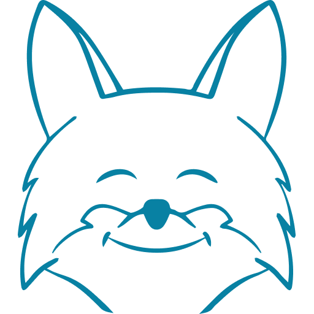

<p align="center">
	<a href="https://github.com/sevenns/leesa.js" title="leesa.js"></a>
	<h3 align="center">leesa.js</h3>
</p>

<p align="center">Small framework for standard frontend development.</p>

### - Requirements

You need [nodejs](https://nodejs.org/en/) with npm (LTS recommended)

### - Setting package.json

``` json5
{
  "scripts": {
    "dev": "leesa",
    "build": "leesa build",
    "start": "leesa start",
    "icons": "leesa icons"
  }
}
```

### - Documentation

Soon...
